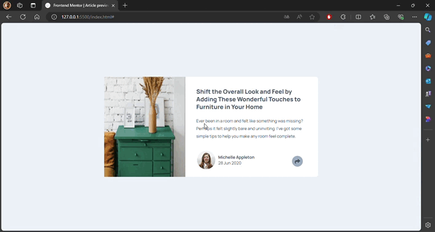

# Frontend Mentor - Article preview component solution

<div align="left">
  <a href="https://www.linkedin.com/in/danae-lescano-salvatierra" target="_blank">
    
  </a>
  <a href="https://lescano713.github.io/Article-Preview-Component/" target="_blank">
    
  </a>
  <a href="https://www.frontendmentor.io/profile/Lescano713" target="_blank">
    
  </a>
</div>


## Table of contents

- [Overview](#overview)
  - [The challenge](#the-challenge)
  - [Screenshot](#screenshot)
- [My process](#my-process)
  - [Built with](#built-with)
  - [What I learned](#what-i-learned)
  - [Continued development](#continued-development)


## Overview

### Screenshot




## My process

### Built with

- Semantic HTML5 markup
- CSS custom properties
- Flexbox
- CSS Grid
- mobile-first workflow
- javaScript


### What I learned

<p>I learned how to create a pseudo element and position it</p>

```css
  .social-media::after{
        content: "";
        width: 25px;
        height: 25px;
        background-color: var(--VeryDarkGrayishBlue);
        position: absolute;
        top: 74%;
        transform: rotate(45deg);
    }
```
<p>I also implemented media queries and grid columns and rows to make the cards responsive on different devices.</p>


```css
    @media (max-width: 1000px) {
        main{
            grid-template-columns: repeat(auto-fit ,minmax(14em,1fr));
            padding: 1.3em 1em ;
        }
    }
    
    @media (max-width: 550px){
      .jeanette-harmon, .jonathan-walters, .kira-whittle{
        grid-column: span 2;
      }
    }

```
<p>I created an array to facilitate data entry, which helped me to reduce the amount of HTML needed</p>

```js
 const articles = [{
    imageAuthor: './images/avatar-michelle.jpg',
    author: 'Michelle Appleton',
    date: '28 Jun 2020',
    imageArticle: './images/drawers.jpg',
    title: 'Shift the Overall Look and Feel by Adding These Wonderful Touches to Furniture in Your Home',
    introduction: 'Ever been in a room and felt like something was missing? Perhaps it felt slightly bare and uninviting. I’ve got some simple tips to help you make any room feel complete.',
    facebook: '#',
    twitter: '#',
    pinterest: '#',
}]
```


<p>Then, I created a function that adds the elements to the DOM from the retrieved data.</p>

```js
 function uploadingArticles (){
    main.innerHTML = "";
    articles.forEach(article =>{
      //html elements
      })
    }
```


### Continued development

<p>In future development, I plan to focus on several key areas:</p>
<p>- <strong>Advanced CSS Grid Techniques</strong>: Further exploration of complex grid layouts and the use of <code>grid-template-areas</code> for more flexible and maintainable designs.</p>
<p>- <strong>Responsive Design</strong>: Enhancing responsive layouts using media queries to ensure that web applications look great on all devices.</p>
<p>- <strong>JavaScript Best Practices</strong>: Improving JavaScript code readability and performance by refactoring and leveraging ES6 features like template literals and destructuring.</p>
<p>- <strong>Integrating APIs</strong>: Fetching and displaying data from external APIs to create more dynamic and interactive web applications.</p>
<p>These areas will help me build more sophisticated, user-friendly, and performant web applications.</p>


